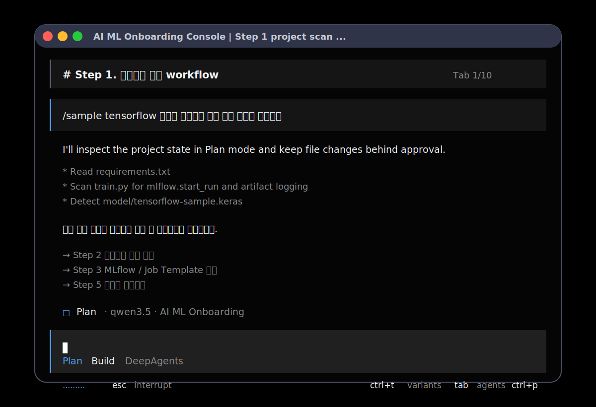

# AI ML 온보딩 POC

폐쇄망 AI/ML 프로젝트 온보딩과 모델 등록 지원을 위한 Launch Mode POC입니다.

빠른 셋팅은 [QUICKSTART.md](QUICKSTART.md)를 먼저 확인하세요.

처음 실행하면 사용자의 숙련도에 따라 세 가지 모드 중 하나를 선택합니다.

1. 초급자 모드: DeepAgents 기반 터미널 로그 TUI Wizard 방식
2. 중급자 모드: Chat + Wizard 혼합
3. 고급자 모드: CLI Command 중심



## 실행

```bash
python3 -m aiu
```

또는 저장소 루트에서 실행 스크립트를 사용할 수 있습니다.

```bash
./ml-agent
```

Windows 10/11에서는 PowerShell 또는 CMD에서 다음처럼 실행합니다.

```powershell
py -3 -m aiu
.\ml-agent.cmd
```

하단 박스 안에 직접 입력되는 Textual TUI는 별도 명령으로 실행합니다.

```powershell
py -3 -m pip install ".[tui,deepagents]"
.\ml-agent.cmd tui
aiu tui
```

Textual 또는 DeepAgents 의존성이 설치되지 않은 상태에서는 안내를 출력하고 기존 콘솔 모드는 그대로 유지됩니다.
macOS/Linux에서는 `python3 -m aiu tui` 또는 `python3 aiu.py tui`로도 같은 TUI를 실행할 수 있습니다.

필수 조건:

- Windows 10 또는 Windows 11
- Python 3.10 이상
- 폐쇄망 환경에서는 Python 설치 파일과 이 저장소를 사전에 반입

처음 셋팅할 때는 샘플 환경 파일을 복사한 뒤 내부 Qwen endpoint 값을 수정합니다.

Linux/macOS:

```bash
cp .env.example .env
python3 -m aiu init
```

Windows 10/11:

```powershell
copy .env.example .env
.\ml-agent.cmd init
```

Python 확인:

```powershell
py -3 --version
python --version
```

PowerShell에서 한글이 깨지면 다음을 먼저 실행합니다.

```powershell
chcp 65001
$OutputEncoding = [Console]::OutputEncoding = [System.Text.UTF8Encoding]::new()
```

어두운 배경과 하단 `Plan / Build` 상태바가 있는 TUI를 보려면 최신 터미널을 권장합니다.
Windows에서는 Windows Terminal, WezTerm, Alacritty에서 가장 안정적입니다.

```env
ENABLE_RICH_CONSOLE=true
ENABLE_TUI_BACKGROUND=false
ENABLE_TUI_INPUT_PANEL=true
```

터미널이 색상 지원을 자동 감지하지 못하면 현재 세션에서 `FORCE_COLOR=1`을 설정한 뒤 실행합니다.
화면에 흰 박스가 생기는 터미널에서는 `DISABLE_TUI_BACKGROUND=1` 또는 `ENABLE_TUI_BACKGROUND=false`를 사용합니다.
하단 입력 박스만 깨지면 `DISABLE_TUI_INPUT_PANEL=1`을 사용합니다.

## 고급자 명령

```bash
./ml-agent analyze ./project
./ml-agent validate ./project
./ml-agent fix ./project --dry-run
./ml-agent apply ./project
./ml-agent serve ./project --dry-run
./ml-agent report ./project
./ml-agent chat
./ml-agent tui
python3 -m aiu tui
python3 aiu.py tui
./ml-agent profile
./ml-agent config
./ml-agent init
./ml-agent prompts
./ml-agent errors list
./ml-agent errors analyze error-YYYYMMDDTHHMMSSZ
```

Windows 10/11:

```powershell
.\ml-agent.cmd analyze .\project
.\ml-agent.cmd validate .\project
.\ml-agent.cmd fix .\project --dry-run
.\ml-agent.cmd apply .\project
.\ml-agent.cmd serve .\project --dry-run
.\ml-agent.cmd report .\project
.\ml-agent.cmd chat
.\ml-agent.cmd tui
aiu tui
.\ml-agent.cmd profile
.\ml-agent.cmd config
.\ml-agent.cmd init
.\ml-agent.cmd prompts
.\ml-agent.cmd errors list
.\ml-agent.cmd errors analyze error-YYYYMMDDTHHMMSSZ
```

JSON 출력이 필요한 경우 `--json` 옵션을 사용할 수 있습니다.

```bash
./ml-agent validate ./project --json
./ml-agent profile --json
```

Windows 10/11:

```powershell
.\ml-agent.cmd validate .\project --json
.\ml-agent.cmd profile --json
.\ml-agent.cmd prompts --json
```

## Deep Agents 참고 구조

이 POC는 [langchain-ai/deepagents](https://github.com/langchain-ai/deepagents)의 agent harness와 [deepagents/libs](https://github.com/langchain-ai/deepagents/tree/main/libs) 구조를 참고했습니다.
터미널 화면 구성은 DeepAgents 실행 흐름에 맞춘 자체 Textual TUI로 제공합니다.
TUI 하단 입력 영역은 `Plan`, `Build`, `Chatbot` 선택 박스를 제공하며 `Tab`으로 순환하거나 `/agent chat`, `/agent build`, `/agent plan`으로 직접 선택할 수 있습니다.

루트는 실행 파일과 문서만 두고, 실제 Agent 코드와 구성 자산은 `deep_agent/` 안에 모읍니다.
DeepAgents 소스는 `deep_agent/vendor/deepagents/deepagents-main/libs`에 포함되어 있습니다.

- sub-agents: `project-scanner`, `mlflow-validator`, `job-template-planner`, `log-analyzer`
- filesystem permissions: 읽기는 허용, 쓰기는 human-in-the-loop 승인, `.git`과 secret 경로 쓰기는 차단
- skills: MLflow 등록 점검, Job Template 초안, 폐쇄망 검증 절차
- memory: 등록 규칙과 팀 Job Template 컨벤션을 별도 메모리 경로로 선언
- context policy: 긴 분석 결과는 요약하고 상세 증거는 리포트 산출물로 남김
- skills 저장소: `SKILL_STORE_DIR` 값으로 지정하며 기본값은 `deep_agent/skills`

현재 구현은 폐쇄망 POC를 위해 외부 런타임 의존성을 강제하지 않는 독립 프로파일입니다.
실제 DeepAgents runtime을 사용할 때는 optional dependency를 설치하고 libs 연결 상태를 확인합니다.

```bash
pip install ".[deepagents,tui]"
./ml-agent deepagents
./ml-agent deepagents --json
```

`aiu deepagents`는 기본적으로 repo 내부의 `deep_agent/vendor/deepagents/deepagents-main/libs`를 먼저 읽습니다. 다른 DeepAgents archive로 비교 검증할 때만 `--source <zip 경로>`를 지정합니다.

`libs/deepagents`는 `create_deep_agent` runtime 연결 대상이고, `libs/code`, `libs/cli`, `libs/evals`, `libs/acp`, `libs/talon`, `libs/partners/*`는 TUI/CLI/evaluation/protocol/provider 확장 참고 축으로 관리합니다.

초급자 Step 1에서 대형 모델 샘플 10개를 만들려면 `/sample large10`을 입력합니다.
샘플은 `.aiu/sample_projects/` 아래에 생성되고 Git에는 포함되지 않습니다.

## 환경 변수

`.env.example`에는 현재 POC 실행에 필요한 Qwen endpoint, 모델 목록, Deep Agent 옵션, 등록 패키지, 에러 로그, 스킬 경로만 포함되어 있습니다.

Qwen 설정은 Agent가 분석과 안내에 사용하는 LLM 설정입니다.
등록 대상 ML 모델은 `analyze`, `validate`, `fix`, `serve`, `report` 명령의 프로젝트 경로로 전달합니다.

주요 값:

- `QWEN_API_KEY`: 내부 Qwen API 키
- `QWEN_BASE_URL`: 내부 OpenAI-compatible Qwen endpoint
- `QWEN_MODEL`: 기본 모델
- `QWEN_MODELS`: 선택 가능한 모델 목록
- `ENABLE_MULTI_AGENT`: sub-agent 분담 사용 여부
- `ENABLE_HARNESS_SKILLS`: Deep Agent skill 저장/로드 사용 여부
- `CHAT_ERROR_DIR`: 에러 로그 저장 경로, 기본값 `.aiu/chat_errors`
- `MASK_SENSITIVE_LOGS`: 에러 로그 민감정보 마스킹 여부
- `REGISTRATION_PACKAGE_DIR`: 등록 패키지 산출물 경로, 기본값 `.aiu/registration_packages`
- `FIX_REPORT_DIR`: 수정 리포트 경로, 기본값 `.aiu/fix_reports`
- `SKILL_STORE_DIR`: skill 저장 경로, 기본값 `deep_agent/skills`
- `WIKI_DIR`: wiki 문서 저장 경로, 기본값 `deep_agent/wiki`
- `WIKI_PROMPT_DIR`: 프롬프트 wiki 저장 경로, 기본값 `deep_agent/wiki/prompts`

설정 요약 확인:

```bash
./ml-agent config
```

Windows 10/11:

```powershell
.\ml-agent.cmd config
```

## 프롬프트와 스킬

기본 프롬프트는 `PROMPT_STORE_PATH` 값이 가리키는 `deep_agent/prompts/prompt_templates.json`에 저장됩니다.
`aiu init`을 실행하면 프롬프트가 `deep_agent/wiki/prompts/` 아래 Markdown/JSON 파일로 자동 저장됩니다.

```bash
./ml-agent prompts
./ml-agent prompts --json
```

Windows 10/11:

```powershell
.\ml-agent.cmd prompts
.\ml-agent.cmd prompts --json
```

기본 스킬은 `deep_agent/skills/` 아래에 저장됩니다.
`aiu init`은 앱이 관리하는 기본 스킬을 최신 내용으로 갱신하고, 사용자가 만든 커스텀 스킬 폴더는 유지합니다.

```text
deep_agent/skills/
├── agent-evaluation/
├── analyze-mlflow-chat-session/
├── analyze-mlflow-trace/
├── closed-network-validation/
├── error-log-repair/
├── instrumenting-with-mlflow-tracing/
├── job-template-draft/
├── mlflow-ai-gateway/
├── mlflow-experiment-tracking/
├── mlflow-model-registry-deployment/
├── mlflow-onboarding/
├── mlflow-prompt-management/
├── mlflow-prompt-optimization/
├── mlflow-registration-check/
├── querying-mlflow-metrics/
├── retrieving-mlflow-traces/
└── searching-mlflow-docs/
```

MLflow skill 구성은 [mlflow/skills](https://github.com/mlflow/skills)의 skill 구조와 [mlflow/mlflow](https://github.com/mlflow/mlflow)의 observability, evaluation, prompt management, prompt optimization, AI Gateway, experiment tracking, model registry, deployment 기능 축을 참고해 폐쇄망 POC용으로 정리했습니다.

## 에러 로그 관리

에러 로그는 `CHAT_ERROR_DIR` 값이 가리키는 `.aiu/chat_errors/`에 저장됩니다.
저장된 에러 로그는 이후 재분석해서 dry-run 수정안을 다시 만드는 기준으로 사용합니다.

에러 로그 저장:

```bash
./ml-agent errors record "ModuleNotFoundError: No module named mlflow"
```

에러 로그 목록:

```bash
./ml-agent errors list
```

에러 로그 분석:

```bash
./ml-agent errors analyze error-YYYYMMDDTHHMMSSZ
```

Windows 10/11:

```powershell
.\ml-agent.cmd errors record "ModuleNotFoundError: No module named mlflow"
.\ml-agent.cmd errors list
.\ml-agent.cmd errors analyze error-YYYYMMDDTHHMMSSZ
```

## 모드 전환

실행 중 다음 명령으로 모드를 바꿀 수 있습니다.

```text
/mode beginner
/mode intermediate
/mode advanced
/모드 초급자
/모드 중급자
/모드 고급자
```

## 안전 규칙

- 기본 동작은 read-only scan입니다.
- 파일 수정 전에는 dry-run 또는 수정안 미리보기를 보여줍니다.
- 초급자 모드에서는 `적용하기 / 다시 보기 / 취소하기` 선택지를 제공하고, 사용자가 `적용하기`를 선택한 경우에만 파일을 수정합니다.
- 고급자 모드에서는 `apply` 명령을 명시적으로 실행한 경우에만 파일을 수정합니다.
- 삭제 작업은 하지 않습니다.
- 적용 후에는 재검증을 수행합니다.
